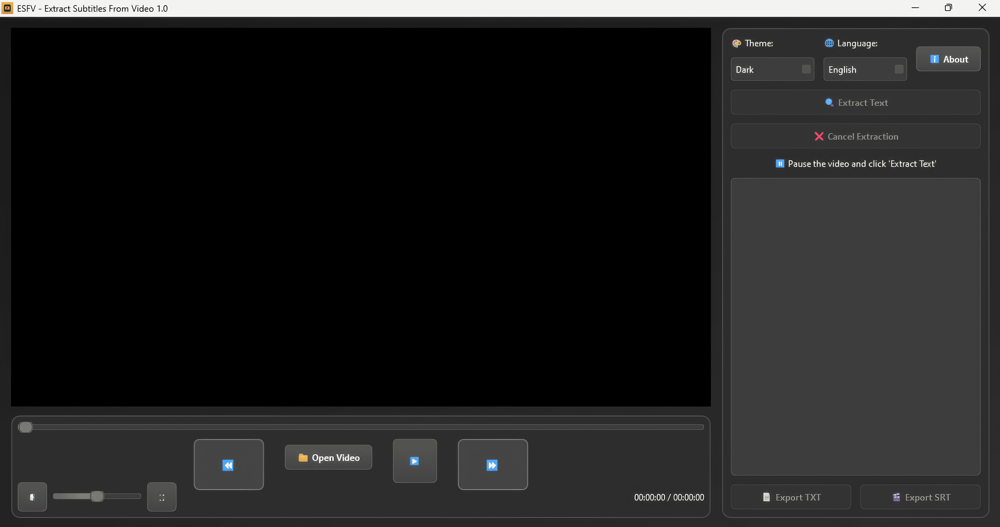

# ESFV - Extract Subtitles From Video

ESFV is a desktop application designed to extract text from videos using OCR (Optical Character Recognition).
It allows you to play videos, pause on specific frames, extract subtitles or any on-screen text,
edit them, and export them in .TXT or .SRT (standard subtitle) formats.

The application supports video formats MP4, MKV, AVI, and MOV.
It works with light/dark themes and supports Spanish and English interfaces.

                 -INSTALLATION AND EXECUTION-  

Download the executable file "ESFV.exe" from the link provided by the developer.
No installation required: simply run the “.exe” file by double-clicking it.
The window will open centered on the screen (minimum 1200x700 pixels).
If you use antivirus software, make sure it allows execution (false positives are common for .exe files).
Note: On the first run, EasyOCR will download language models (Spanish/English).
The executable is standalone and includes all necessary dependencies.

                      -USER INTERFACE-  

The interface is divided into two main panels:
Left Panel: Video Player.
Video area (black background with rounded corners).
Bottom controls: progress bar, navigation buttons, volume, and fullscreen.
Right Panel: OCR and Editing Module.
Theme and language selectors. Themes: Dark or Light. Languages: Spanish or English.
Recognition and cancel buttons.
Progress bar for OCR/export.
List of extracted text blocks (editable).
Export buttons.

                     -TIPS-  

Pause on clear frames with visible text to improve OCR accuracy, and manually edit if needed.
The start time is set automatically,
but the end time must be set manually — let the video play forward and click “Set End”.

                  -KEYBOARD SHORTCUTS-  

Space: Play/Pause.
Left Arrow: Rewind 2s.
Right Arrow: Fast forward 5x (hold).
Up/Down Arrows: +10% / -10% volume.
M: Mute/Unmute.
F: Fullscreen.
F: Exit fullscreen.

This app is designed to extract burned/rendered subtitles from a video. 
I suppose that in some contexts it could be used in an educational
context to extract information from videos with slides, conferences, etc.

Thank you for using ESFV! If you like it, please consider donating 🖤
https://ko-fi.com/eberload

------------------------------------------------------------------------------------------
------------------------------------------------------------------------------------------

ESFV es una aplicación de escritorio diseñada para extraer texto de videos
utilizando OCR (Reconocimiento Óptico de Caracteres).
Permite reproducir videos, pausar en frames específicos, extraer subtítulos o cualquier texto en el video,
editarlos y exportarlos en formatos .TXT o .SRT (subtítulos estándar).

La aplicación soporta videos en formatos MP4, MKV, AVI y MOV.
Funciona en temas claro/oscuro, interfaz en español/inglés.

                    -INSTALACIÓN Y EJECUCIÓN-

1. Descarga el archivo ejecutable "ESFV.exe" desde el enlace proporcionado por el desarrollador.
2. No requiere instalación: simplemente ejecuta el archivo ".exe" haciendo doble clic.
3. La ventana se abrirá centrada en pantalla (mínimo 1200x700 píxeles).
4. Si usas antivirus, asegúrate de que permita la ejecución (falsos positivos comunes en .exe).

Nota: En la primera ejecución, EasyOCR descargará modelos de idioma (español/inglés).
El ejecutable es standalone, incluye todas las dependencias necesarias.

                      -INTERFAZ DE USUARIO-

La interfaz se divide en dos paneles principales:

  - Panel Izquierdo: Reproductor de video.
  - Área de video (fondo negro con bordes redondeados).
  - Controles inferiores: Barra de progreso, botones de navegación, volumen y pantalla completa.
  - Panel Derecho: Módulo OCR y edición.
  - Selectores de tema e idioma. Temas: Oscuro o Claro. Idiomas: Español o Inglés. 
  - Botón de reconocimiento y cancelación.
  - Barra de progreso para OCR/exportación.
  - Lista de bloques de texto extraídos (editable).
  - Botones de exportación. 

                              -CONSEJOS-
1. Pausa en frames con textos claros para mejorar la precisión OCR y edita manualmente si hay errores.
2. El punto de inicio se configura automáticamente,
pero el final se establece manualmente, deja avanzar el video y haz clic en "establecer fin".

                       -ATAJOS DE TECLADO-

- Espacio: Reproducir/Pausar.
- Flecha Izquierda: Retroceder 2s.
- Flecha Derecha: Avance rápido 5x (mantén presionada).
- Flecha Arriba/Abajo: +10% / -10% volumen.
- M: Silenciar/Activar sonido.
- F: Pantalla completa.
- F: Salir de fullscreen.

Esta app esta creada con la finalidad de extraer los subtítulos quemados/renderizados en un video. 
Supongo que en algunos contextos puede ser usada en algún contexto educativo para extraer
información de videos con diapositivas, conferencias, etc.  

¡Gracias por usar ESFV! Si te gusta, considera donar🖤.
https://ko-fi.com/eberload
